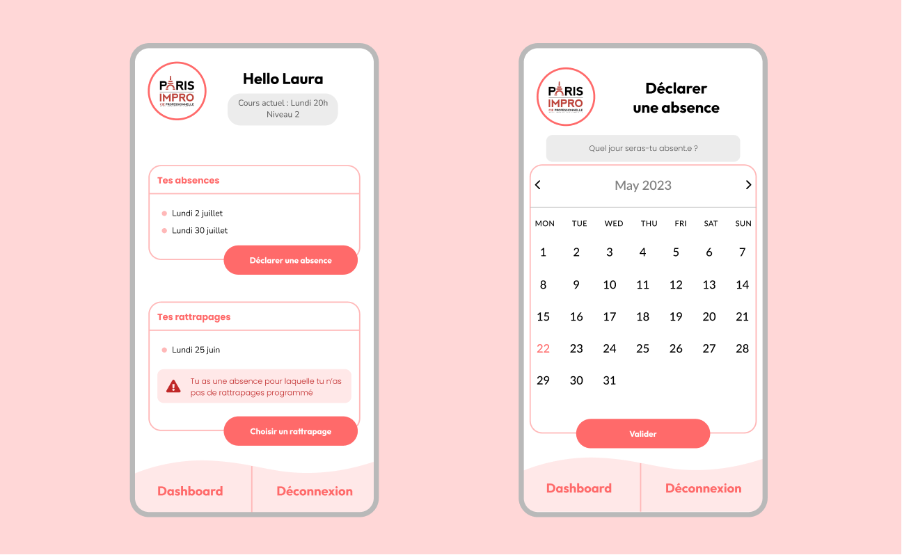

<br />
<a name="readme-top"></a>
<br />
<div align="center">
  <a href="https://github.com/jlbrunet/portfolio">
    
  </a>
  <h3 align="center">Paris Impro</h3>
  <p align="center">
     This application allows the students of Paris Impro to declare absences and cath them another day.
    <br />
    <br />
  </p>
</div>

<details>
  <summary>Table of Contents</summary>
  <ol>
    <li>
      <a href="#about-the-project">About The Project</a>
      <ul>
        <li><a href="#built-with">Built With</a></li>
      </ul>
    </li>
    <li>
      <a href="#getting-started">Getting Started</a>
      <ul>
        <li><a href="#prerequisites">Prerequisites</a></li>
        <li><a href="#installation">Installation</a></li>
        <li><a href="#installation">Available scripts</a></li>
      </ul>
    </li>
    <li><a href="#roadmap">Roadmap</a></li>
    <li><a href="#contact">Contact</a></li>
  </ol>
  <br />
</details>


## About The Project

<br />
<div align="center"></div>
<br />

<div>This project has two interface :
  <ul>
    <li><b>A student interface:</b> the student can choose a date on a calendar to declare an absence on its slot times and then see the available catch-ups on another calendar to take a class another day.</li>
    <li><b>An administrator interface:</b> the director of the theater company can see all the absences and catch-ups by class and level.</li>
  </ul>
</div>


### Built With

* [![Ruby.com][Ruby.com]][Ruby-url]
* [![RoR.com][RoR.com]][RoR-url]
* [![PostgreSql.com][PostgreSql.com]][PostgreSql-url]
* [![Bootstrap.com][Bootstrap.com]][Bootstrap-url]
<br />

## Getting Started

### Prerequisites

* npm
  ```sh
  npm install npm@latest -g
  ```


### Installation

1. Clone the repo
   ```sh
   git clone https://github.com/github_username/repo_name.git
   ```
2. Install NPM packages
   ```sh
   npm install
   ```

   
### Available Scripts

Runs the app in the development mode :
```sh
npm run start
```
The page will reload when you make changes. You may also see any lint errors in the console.

Launches the test runner in the interactive watch mode :
```sh
npm run test
```
<br />

## Roadmap

- [x] Implement the Home, About, Projects, and Footer components in the React App.
    - [x] Implement a ScrollButton in the Home Component to smoothly navigate to the About section.
          A ScrollButton has been added to the Home component, allowing users to smoothly scroll to the About section for a better user experience.
- [x] Enhance the About Component with dynamic content, styling, and interactive elements.
    - [x] Implement a ScrollButton in the About Component to smoothly navigate to the Projects section.
          A ScrollButton has been added to the About component, allowing users to smoothly scroll to the Projects section for a better user experience.
- [x] Develop the Projects Component to showcase project cards, modals of the projects videos, and interactive features.
<br />


## Contact

juliebrunet.pro@outlook.fr

[https://github.com/jlbrunet/portfolio](https://github.com/jlbrunet/portfolio)

<!-- MARKDOWN LINKS & IMAGES -->
[Ruby.com]: https://img.shields.io/badge/Ruby-CC342D?style=for-the-badge&logo=ruby&logoColor=white
[Ruby-url]: https://www.ruby-lang.org/fr/
[RoR.com]: https://img.shields.io/badge/Ruby_on_Rails-CC0000?style=for-the-badge&logo=ruby-on-rails&logoColor=white
[RoR-url]: https://rubyonrails.org/
[PostgreSql.com]: https://img.shields.io/badge/PostgreSQL-316192?style=for-the-badge&logo=postgresql&logoColor=white
[PostgreSql-url]: https://www.postgresql.org/
[Bootstrap.com]: https://img.shields.io/badge/Bootstrap-563D7C?style=for-the-badge&logo=bootstrap&logoColor=white
[Bootstrap-url]: https://getbootstrap.com

